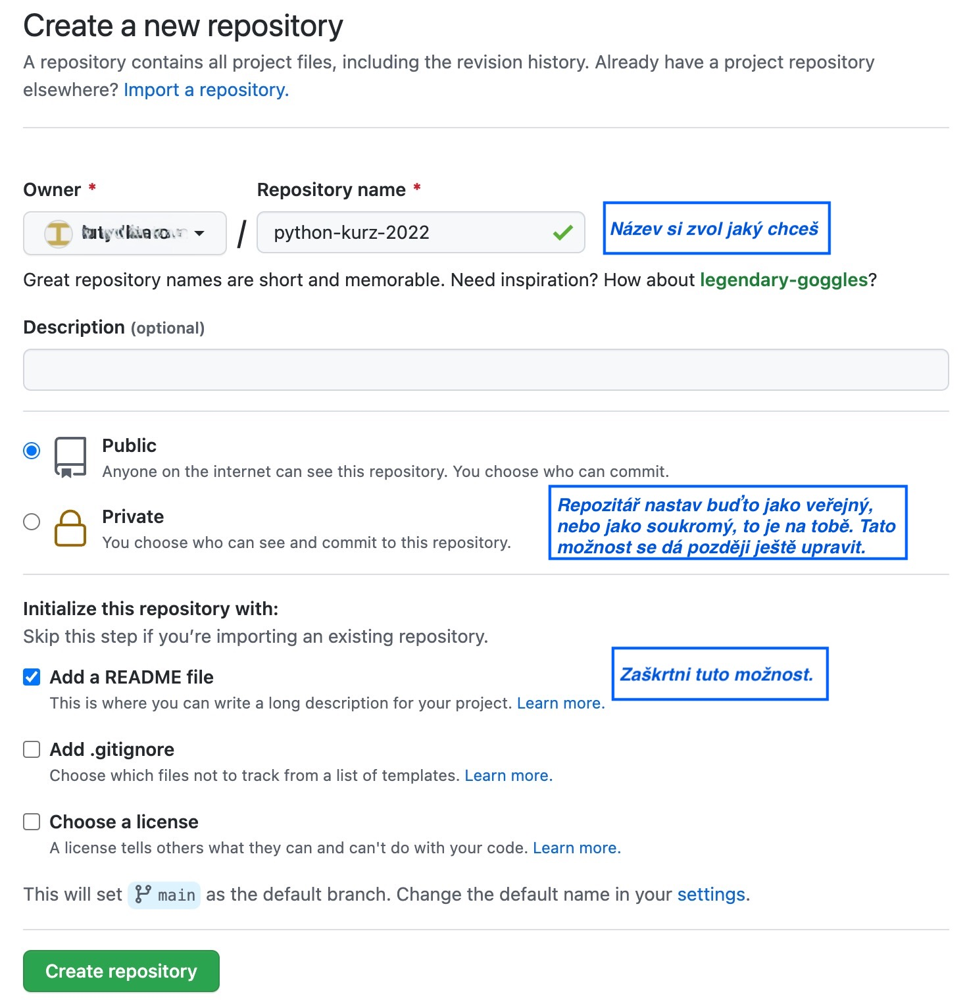
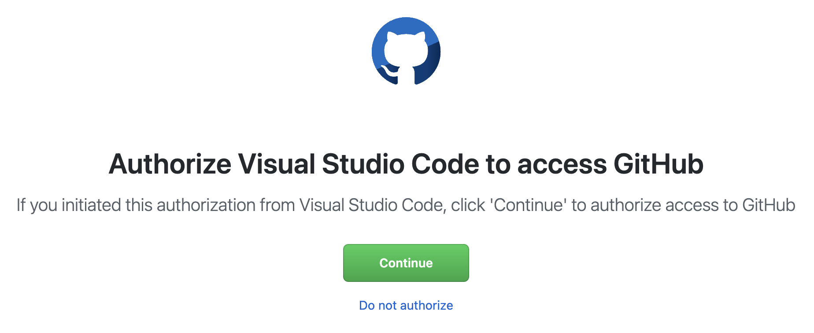

# Jak na GitHub a odevzdávání úkolů

## Obsah
1. [Jak na GitHub](#jak-na-github)
2. [Přidání kouče do repozitáře](#p%C5%99id%C3%A1n%C3%AD-kou%C4%8De-do-repozit%C3%A1%C5%99e)
3. [Odevzdávání úkolů](#odevzd%C3%A1v%C3%A1n%C3%AD-%C3%BAkol%C5%AF)

Ověř, že máš hotové všechny [instalace](./INSTALACE.md), včetně sekce *Instalace a nastavení Gitu*.

## Jak na GitHub

### Vytvoření repozitáře

1. V první řadě je potřeba si vytvořit účet na stránce [github.com](https://github.com/). K tomu by měla stačit e-mailová adresa a nějaké uživatelské jméno. Pokud už na GitHubu účet máš, nemusíš si zakládat nový.

2. Přihlaš se do svého účtu a vytvoř si nový repozitář kliknutím na symbol `+` v pravém horním rohu:

3. V dialogu vytváření repozitáře postupuj podle obrázku:

4. Na závěr potvrď stisknutím zeleného tlačítka *Create repository*.

### Jak propojit repozitář na GitHubu s VS Code

1. Otevři VS Code. Pokud už je otevřené, zadej na horní liště *File → New Window*, aby se ti otevřelo úplně nově. Klikni na ikonu papírů v levé liště a pak na *Clone Repository*:

2. Klikni na *Clone from GitHub*:

3. V prohlížeči potvrď autorizaci a případně zadej své GitHub přihlašovací údaje:

4. Při návratu do VS Code by teď mělo být možné vybrat tvůj repozitář. Klikni na jeho název, a vyber umístění v rámci tvého systému, kam se repozitář stáhne. Složku s repozitářem můžeš rovnou otevřít (možnost *Open*).

Hurá, máš propojený repozitář na GitHubu s jeho lokální verzí u tebe na počítači. :tada: Od teď už nemusíš výše uvedené kroky opakovat. Když budeš chtít pracovat na úkolu, otevři si Visual Studio a pak pomocí *Open Folder* otevři složku s tvým repozitářem.

## Přidání kouče do repozitáře

1. Na stránce tvého repozitáře (url by mělo vypadat jako `github.com/<uzivatelske-jmeno>/<nazev-repozitare>`) přejdi do nastavení kliknutím na *Settings*, a dále pak v levé liště klikni na *Collaborators* a pak na *Add people* (tlačítka jsou označeny modrými hvězdičkami):

2. Otevře se okno, do kterého zadej uživatelské jméno tvého kouče (viz tabulka koučů a jejich uživatelských jmen). Výběr potvrď.

## Odevzdávání úkolů
Jakmile máme vytvořený repozitář na GitHubu a jeho kopii ve VS Code, můžeme nahrávat úkoly a posílat je koučům.

### Vytvoření souboru s úkolem a nahrání na GitHub

1. Ve Visual Studiu vypracuj úkol jako soubor s příponou `.py`, například `ukol-x.py`.

2. Klikni na levé liště na obrázek "větví" (*Source Control*). V sekci *Changes* by se měl nacházet tvůj soubor.

3. U souboru, který chceš nahrát, klikni na znamení `+`. Soubor se přesune do sekce *Staged Changes*.

4. Nyní úkol připravíme k odevzdání, a provedeme takzvaný *commit*. Klikni na ikonu fajfky. Nahoře v prostřed okna s Visual Studiem se objeví dialog, do kterého napiš krátké shrnutí - například *Úkol č. X* a stiskni Enter.

5. Na závěr nahrajeme tuto změnu na GitHub. Klikni na obrázek dvou šipek v cyklu zcela dole a vlevo.

### Vytvoření Issue na GitHubu - závěrečný krok odevzdání

1. Na GitHubu na stránce tvého repozitáře klikni na *Issues* a pak vytvoř nové Issue pomocí tlačítka *New Issue* (tlačítka jsou označeny modrými hvězdičkami).

2. Do názvu zadej číslo úkolu, například *Úkol 2*. Do popisku zadej odkaz na soubor s tvým úkolem a případný komentář nebo dotazy.

3. Pak zadej kouče v sekci *Assignees* kliknutím na ozubené kolečko, aby koučovi nebo koučce přišlo upozornění, že je odevzdaný nový úkol. Akci dokončíš kliknutím na *Submit new issue*. Hotovo! :tada:
* > Pokud se ti v *Assignees* nezobrazuje jméno kouče, patrně zatím nepotvrdil/a přidání do tvého repozitáře. Zkus se jim připomenout na Slacku.
