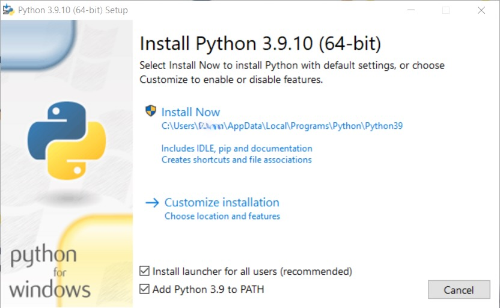
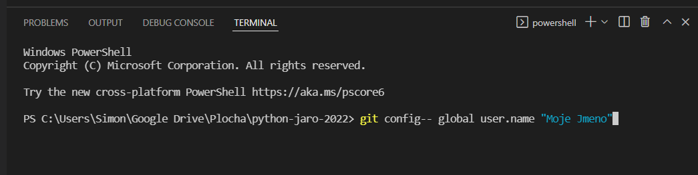

# Instalace
V kurzu budeme pracovat s programovacím jazykem [Python](https://www.python.org/) v prostředí [Visual Studio Code](https://code.visualstudio.com/). Pokud tyto nástroje ještě nemáš nainstalované, níže najdeš instrukce k instalaci.

> V této sekci z velké části využíváme existujících instalačních návodů ze stránky https://kodim.cz/czechitas/uvod-do-progr/priprava/jazyky-nastroje , s mírnými úpravami.

## Obsah
1. [Instalace jazyka Python](#instalace-jazyka-python)
  - [Windows](#windows)
  - [Mac OS](#mac-os)
  - [Linux](#linux)

2. [Instalace editoru Visual Studio Code](#instalace-editoru-visual-studio-code)
  - [Windows](#windows)
  - [Mac OS](#mac-os)
  - [Linux](#linux)

3. [Nastavení VS Code (nepovinné)](#nastaven%C3%AD-vs-code-nepovinn%C3%A9)
4. [Ověření instalace Pythonu](#ov%C4%9B%C5%99en%C3%AD-instalace-pythonu)
5. [Rozšíření VS Code pro Python (nepovinné)](#roz%C5%A1%C3%AD%C5%99en%C3%AD-vs-code-pro-python-nepovinn%C3%A9)
6. [Instalace a nastavení Gitu](#instalace-a-nastaven%C3%AD-gitu)

## Instalace jazyka Python
### Windows
Pokud máš počítač s Windows, následuj tyto kroky:

1. Ujisti se, že máš aktualizovaný systém. To zajistíš nejjednodušeji tak, že svůj počítač restartuješ.

2. Stáhni si instalaci jazyka Python z [tohoto odkazu](https://www.python.org/ftp/python/3.9.10/python-3.9.10-amd64.exe). Stažený soubor spusť. Rozběhne se průvodce instalací.

3. Na úvodní obrazovce je **velmi důležité** zaškrtnout volbu *Add Python 3.9 to PATH* (viz obrázek)


4. Klikni na *Install Now*, odsouhlas případné otázky ohledně změn na vašem počítači a vyčkej dokončení instalace. Jakmile instalace skončí, zavři okno tlačítkem *Close*.

5. Pro jistotu restartuj počítač, aby se provedené změny správně usadily.

### Mac OS
Pokud máš počítač s Mac OS, je velmi pravděpodobné, že už máš Python nainstalovaný. Ověř si instalaci.

1. Pokud ti Python chybí, stáhní si instalaci jazyka Python z [tohoto odkazu](https://www.python.org/ftp/python/3.9.10/python-3.9.10-macos11.pkg).

2. Stažený soubor spusť a pokračuj dle pokynů instalace až do jejího konce.

### Linux
Pokud používáš některou z populárních distribucí Linuxu jako Ubuntu, Linux Mint apod., je velmi pravděpodobné, že už máš Python nainstalovaný. Ověř si instalaci.

## Instalace editoru Visual Studio Code
### Windows
Pokud máš počítač s Windows, následuj tyto kroky:

1. Z [tohoto odkazu](https://aka.ms/win32-x64-user-stable) si stáhni Visual Studio Code.

2. Stažený soubor spusť. Rozběhne se průvodce instalací, ve kterém stačí klikat na *Next* tak dlouho, dokud se nespustí instalace. Ve druhém kroku je pouze potřeba souhlasit s licencí.

3. Jakmile instalace doběhne, zavři okno tlačítkem Finish. Visual Studio Code by se mělo samo spustit ihned po instalaci.

### Mac OS
Pokud máš počítač s Mac OS, následuj tyto kroky:

1. Na [oficiální stránce](https://code.visualstudio.com/) si stáhni Visual Studio Code (modré tlačítko *Download Mac ...*).

2. Spusť instalaci a následuj ji až do zdařilého konce.

### Linux
Pokud máš počítač s Linuxem, následuj tyto kroky:

1. Na [oficiální stránce](https://code.visualstudio.com/) si stáhni Visual Studio Code (modré tlačítko *.deb* pro Debian/Ubuntu, nebo *.rpm* pro Red Hat/Fedora).

2. Spusť instalaci a následuj ji až do zdařilého konce.

## Nastavení VS Code (nepovinné)
Aby se nám ve VS Code dobře programovalo, uložíme si některá užitečná nastavení. Spusť VS Code a z horního menu vyber **View → Command Palette...**. Do textového políčka zkopíruj tento text:

```
Open Settings (JSON)
```
a stiskni enter.
Otevře se okno s editorem. Do jeho pravé časti vlož tento text (přepiš cokoliv, co v editoru bylo dosud):

```json
{
  "editor.tabSize": 4,
  "editor.detectIndentation": false,
  "editor.renderWhitespace": "boundary",
  "editor.insertSpaces": true,
  "editor.wordWrap": "on",
  "files.eol": "\n",
  "editor.minimap.enabled": false,
  "editor.fontSize": 16
}
```

a ulož stiskem Ctrl+S nebo z menu vyber **File → Save**.

## Ověření instalace Pythonu
Ať už jsi na jakémkoliv operačním systému, spusť Visual Studio Code a z horní lišty vyber **Terminal → New Terminal**. 
Pokud jsi na Windows, napiš do okna, které se objeví, toto:
```
python
```
a stiskni enter. Pokud jsi na Macu nebo Linuxu, může být potřeba napsat
```
python3
```
Pokud je vše v pořádku, měly by se po pár krypticky vypadajících výpisech ukázat tři zobáčky `>>>` a kurzor. To znamená, že Python je na vás připraven.

## Rozšíření VS Code pro Python (nepovinné)
Pro jednodušší spouštění programů a automatickou kontrolu syntaxe Pythonu ve VS Code si můžeš nainstalovat rozšíření.


1. Na levé liště editoru VS Code klikni na ikonu "kostek", nebo v horní liště vyber **View → Extensions**

2. Do zobrazeného vyhledávacího pole zadej "python"

3. Jako jeden z prvních výsledků se ti zobrazí rozšíření *Python*, jehož autorem je Microsoft a má v rohu hvězdičku, která označuje ověřené rozšíření. Toto rozšíření nainstaluj kliknutím na tlačítko **Install** (pokud se ti tlačítko nezobrazuje, rozšíření už pravděpodobně máš nainstalované.).

## Instalace a nastavení Gitu
Pro odevzdávání úkolů na úložiště GitHub budeme využívat systém Git.

1. Git si stáhni z [tohoto odkazu](https://git-scm.com/downloads) (modré tlačítko vpravo *Download for ...*). Víceméně se můžeš proklikat nastavením až na závěr.
* > Pokud jsi na Macu, zvol možnost *Binary installer* (odkaz povede [sem](https://sourceforge.net/projects/git-osx-installer/))

2. Pokud máš otevřené Visual Studio, tak ho restartuj zavřením programu a opětovným otevřením. Ve Visual Studiu z horní lišty vyber **Terminal → New Terminal**. 

3. Do terminálu napiš následující řádku: `git config --global user.name "Moje Jmeno"`, akorát `Moje Jmeno` nahraď tvým jménem (nemusí být s příjmením).
Například:
```
git config --global user.name "Jana Mala"
```
nebo:
```
git config --global user.name "Jana M."
```
A stiskni enter.

Na Windows by to mělo vypadat asi takhle (a na jiných operačních systémech velice podobně):


4. Podobně zadej e-mail:
`git config --global user.email "email"`, akorát `email` nahraď tvým emailem.
Například:
```
git config --global user.email "jana.email@mujmail.com"
```
nebo:
```
git config --global user.email "jana@mujmail.com"
```
A stiskni enter.
