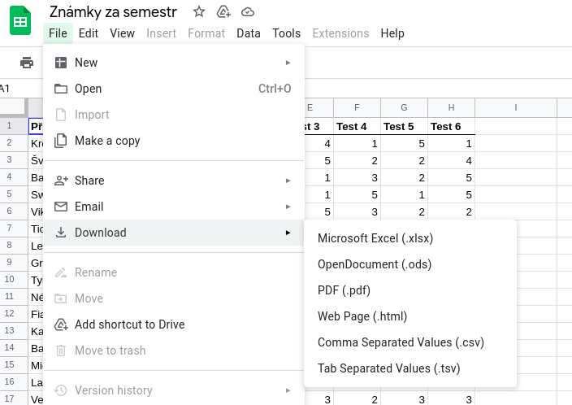

# ukol-06: Zapis + Cteni ze souboru

Deadline: 12.11.2022

Vyberte si kterou variantu chcete, pro odvážnější jsem sepsala jen [obecne požadavky](#obecné-požadavky-na-úkol-vyžaduje-více-času-a-vlastní-iniciativy).
Kdo se nechce zdržovat s vymýšlením a chce si procvičit látku na konkrétním zadání, může použít [druhou variantu](#vymyšlené-zadání).

## Materialy
* [kapitola na kodim z lekce](https://kodim.cz/kurzy/python-data/zaklady-programovani/soubory)

## Obecné požadavky na úkol (vyžaduje více času a vlastní iniciativy)

1. Nacist textovy soubor
2. Modifikovat nejaka nactena data
3. Modifikovana data zapsat znovu do souboru
## Vymyšlené zadání

Univerzita pro celoživotní vzdělávání se rozhodla změnit svůj známkovací systém z číselných známek 1 až 5 na hodnocení písmeny A až F. Bohužel změna se odehrála jaksi uprostřed semestru, takže je potřeba změnit aktuální výkazy o známkách z čísel na písmena. Nechte se vést následujícím postupem.

1. Otevřete si [dokument](https://docs.google.com/spreadsheets/d/1mm2iZ2TWosQ4Yv4cahgMQrMsicneTrkrcdVP3Nz1PQY/edit?usp=sharing) s jedním výkazem známek.
2. Zkopírujte si tuto tabulku do textového souboru - ulozte si ho to stejne slozky jako skript s resenim domaciho ukolu.
   * Je jedno jak si ho pojmenujete, ten nazev pak budete pouzivat ve vasem programu
3. Napište program, který tuto tabulku načte ze souboru (z toho ktery jste si vytvorily) a změní všechny známky tak, že 1 bude A, 2 bude B, 3 bude C, 4 bude D a 5 bude F.
   * Existuje vic zpusobu reseni, zamyslete se jestli se vam treba nehodi nejaka datova struktura o ktere jsme se ucili, pripadne podminky (pro fajnsmekry se to resit i s Tridami)
4. Vypište váš výsledek do nějakého souboru tak, aby se z něj dal zase zkopírovat do tabulky Google.

**Uz umite funkce - nezapominejte na to, pokud potrebujete neco udelat vickrat dejte ten kod do funkce kterou pak muzete znovu volat.**

**Zaroven se nebojte si problem rozkouskovat na vic mensich, muzete mit kus kodu (funkci) ktery zapisuje do souboru, kus ktery meni znamky a kus ktery cte ze souboru.**

---
### Bonus:

Zkuste misto textoveho souboru, pouzit primo csv soubor - muzete stahnout z google sheetu viz obrazek nize.

Podivejte se na [dokumentaci](https://docs.python.org/3/library/csv.html) k modulu `csv` (ktery vyuzijte). Pokud by vam prisla oficialni dokumentace moc technicka (moc informaci navic) zkuste googleni a najdete jednodusi tutorial - existuje jich opravdu hodne.
