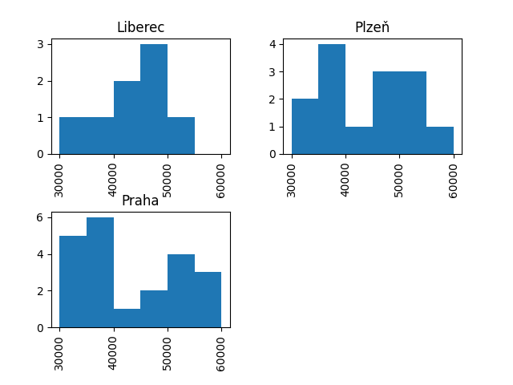

# ukol-12: Vizualizace

## Histogram platů

Stáhni si soubor [platy_2021_02.csv](data/platy_2021_02.csv) s informacemi o platech v softwarové firmě.

```
import requests

r = requests.get("https://raw.githubusercontent.com/andywaltlova/python-1-podzim-2022/master/ukoly/data/platy_2021_02.csv")
open("platy_2021_02.csv", "wb").write(r.content)
```

Načti si tato data do tabulky a vytvoř histogram. Nastav vhodně hranice skupin histogramu (parametr `bins`), aby byl graf přehledný a snadno interpretovatelný.

### Dobrovolný doplněk

Vyzkoušej si vytvořit podgrafy. `pandas` a `matplotlib` to umí poměrně jednoduše a to pomocí parametru `by` metody `hist()`. Jako parametr vlož sloupec, podle kterého chceš data do podgrafů rozdělit. Musíš vložit sloupec ve formě dat, nikoli pouze jeho název. 

Vytvoř pro zadaná data podgrafy pro jednotlivá města. Načti si informace o městě, ve kterém jednotliví pracovníci pracují (to jsme již dělali v minulém úkolu). Následně sloupec `mesto` použij na rozdělení podgrafů.

Příklad výstupu je na obrázku níže.



## Teplota ve městech

Vrať se k práci se souborem [temperature.csv](data/temperature.csv), který obsahuje informace o průměrné teplotě v různých městech v **listopadu 2017**.

```
import requests

r = requests.get("https://raw.githubusercontent.com/andywaltlova/python-1-podzim-2022/master/ukoly/data/temperature.csv")
open("temperature.csv", "wb").write(r.content)
```

* Vytvoř tabulku, která bude obsahovat údaje o teplotě za města Helsinki, Miami Beach a Tokyo.
* Vytvoř krabicový graf a porovnej rozsah teplot v těchto městech.